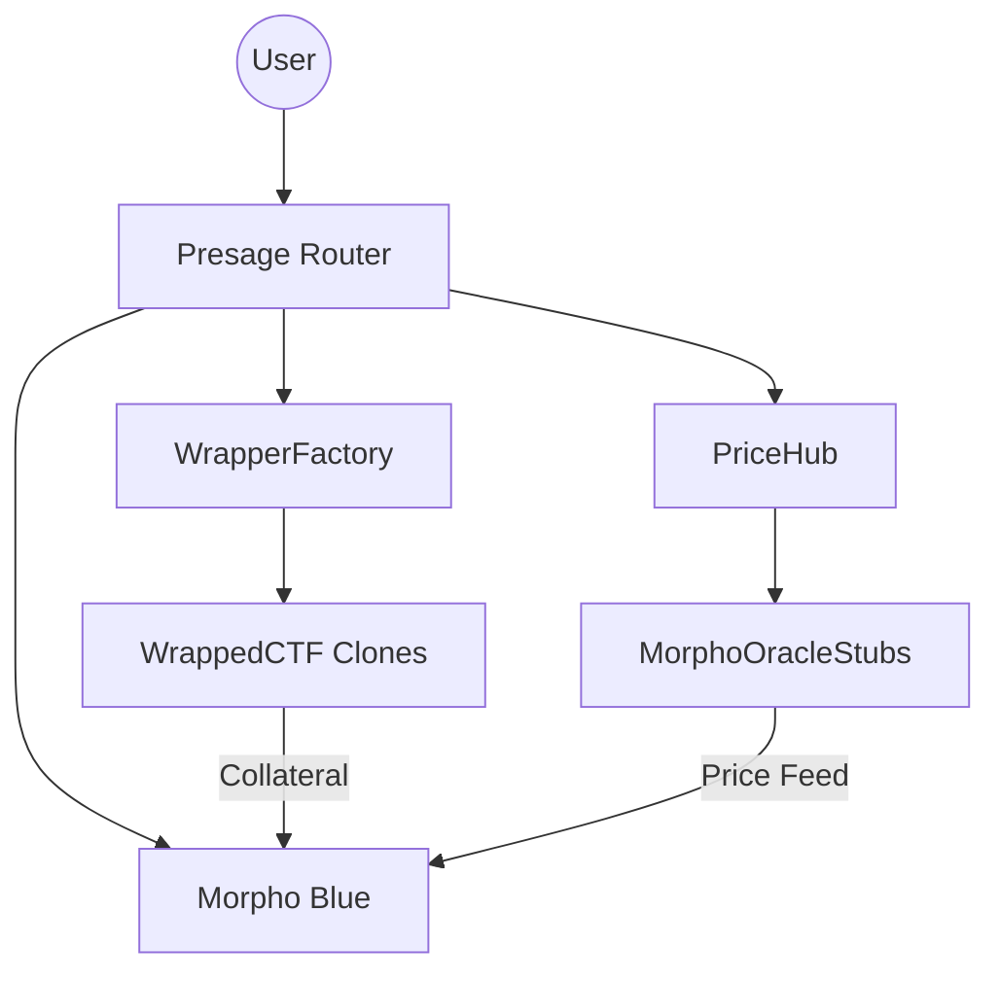

<p align="center">
  
</p>

<p align="center">
  <strong>Unlock the value of your predictions.</strong><br>
  Borrow stablecoins against prediction market CTF tokens via Morpho Blue.
</p>

---

## For the Layman: What is Presage?

Imagine you've bet $1,000 that a certain event will happen (like a sports game or an election) on a platform like **predict.fun**. Your money is now "locked" in that bet until the event ends.

**Presage** lets you "unlock" that money without canceling your bet.

1. **Deposit your Bet:** You put your prediction tokens (CTFs) into Presage.
2. **Borrow Cash:** Presage gives you stablecoins (like USDT) immediately.
3. **Keep the Upside:** If your prediction is right, you still win! You just pay back the loan to get your winning tokens back.
4. **Safety First:** We use **Morpho Blue**, one of the most secure lending engines in crypto, to make sure your assets are safe and handled professionally.

**In short: Don't wait for the finish line. Use your winning positions as collateral today.**

---

## Technical Overview

Presage is a permissionless lending adapter that bridges **Gnosis Conditional Tokens (ERC1155)** with **Morpho Blue (ERC20-only lending)**. It provides the necessary infrastructure to treat binary outcome tokens as high-quality collateral.

### Core Features

- **ERC20 Wrapper:** A factory-based system that creates gas-efficient EIP-1167 clones to wrap specific ERC1155 `positionId`s into standard ERC20s.
- **Oracle Hub:** A specialized oracle registry that handles the unique lifecycle of prediction tokens, including **Time-Based LLTV Decay** (reducing borrowing power as the event resolution nears to prevent "late-game" volatility).
- **Morpho Integration:** Direct routing to Morpho Blue, utilizing its singleton efficiency and customizable IRMs (Interest Rate Models).
- **Safe-Native:** Built-in helpers to encode `multiSend` payloads, allowing Gnosis Safe users to Wrap, Deposit, and Borrow in a single atomic transaction.

### Architecture



---

## Quick Start

### Installation & Compilation

```sh
npm install
npx hardhat compile
```

### Testing Suite

| Test Type       | Command                                             | Description                                         |
| --------------- | --------------------------------------------------- | --------------------------------------------------- |
| **Unit**        | `npx hardhat test test/Presage.unit.test.ts`        | Core logic, wrapping, and oracle stubs (Local).     |
| **Fork**        | `npx hardhat test test/Presage.fork.test.ts`        | Full lending flow against a BNB Mainnet fork.       |
| **Integration** | `npx hardhat test test/Presage.integration.test.ts` | Real CTF acquisition via predict.fun (BNB Testnet). |

_Note: For Fork tests, ensure `BNB_RPC_URL` is set in your `.env` (Alchemy/QuickNode recommended)._

---

## Contract Summary

| Contract              | Purpose                                                                        |
| --------------------- | ------------------------------------------------------------------------------ |
| `Presage.sol`         | The main entry point. Orchestrates market creation and user operations.        |
| `WrappedCTF.sol`      | Lightweight ERC1155 ↔ ERC20 bridge with flash-unwrap support.                  |
| `PriceHub.sol`        | Central registry for prices and decay logic; spawns Morpho-compatible oracles. |
| `WrapperFactory.sol`  | Deploys deterministic wrappers using `CREATE2`.                                |
| `SafeBatchHelper.sol` | Utility for encoding atomic batch transactions for Safe wallets.               |

---

## Network Information (BNB Chain)

### Mainnet (Chain 56)

- **Morpho Blue:** `0x01b0Bd309AA75547f7a37Ad7B1219A898E67a83a`
- **AdaptiveCurveIRM:** `0x7112D95cB5f6b13bF5F5B94a373bB3b2B381F979`
- **USDT:** `0x55d398326f99059fF775485246999027B3197955`

### Testnet (Chain 97)

- **predict.fun API:** `https://api-testnet.predict.fun/v1`

---

## License

This project is proprietary. **All Rights Reserved.** 

Unauthorized copying, distribution, or use of this software is strictly prohibited. See the `LICENSE` file for full details.
