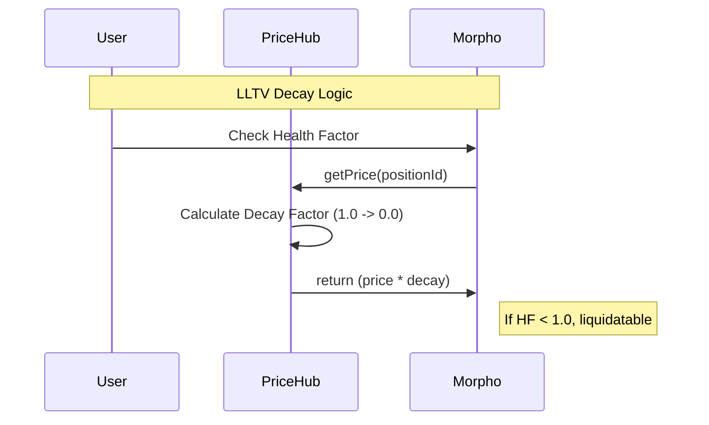
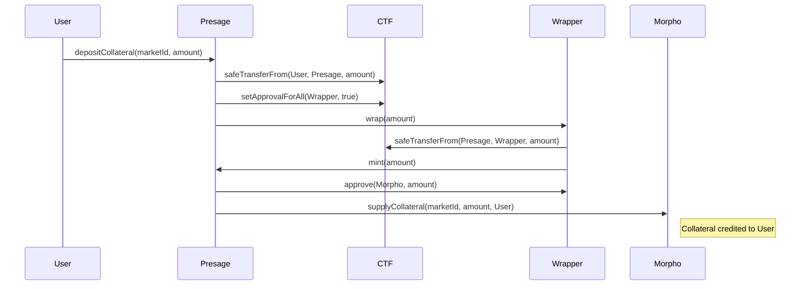
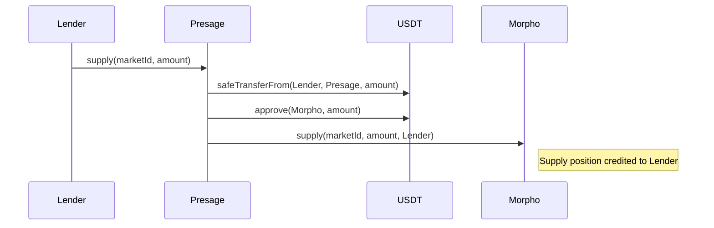
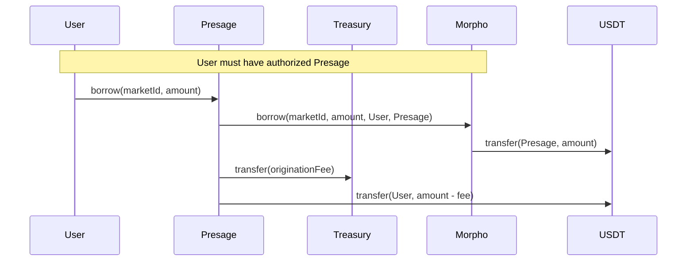
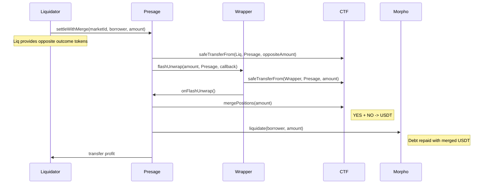
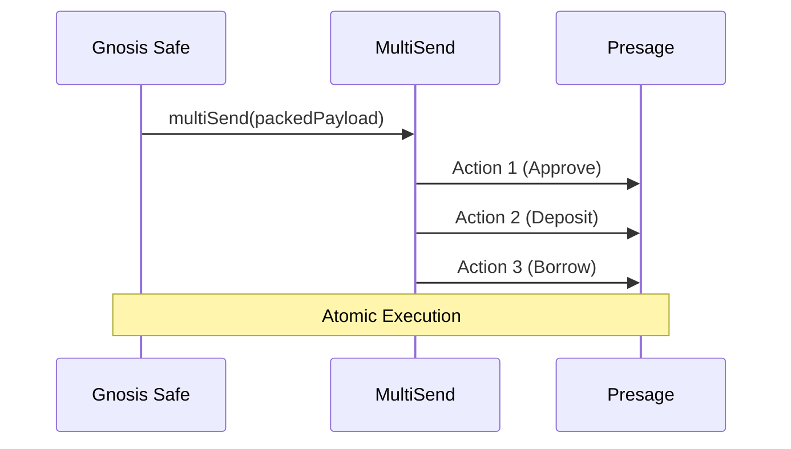

# Presage Protocol — Architecture Guidebook

## What Problem Are We Solving?

Prediction markets (Polymarket, predict.fun, Omen) let you buy outcome tokens — "YES this will happen" or "NO it won't." These tokens are ERC1155 tokens from the Gnosis Conditional Tokens Framework (CTF). If the outcome resolves in your favor, each token pays out $1 in the underlying stablecoin. If not, it's worth $0.

The problem: you believe an outcome is likely, you're holding YES tokens worth $0.80 each, but your capital is locked. You can't use those tokens anywhere else in DeFi because they're ERC1155 — and most DeFi protocols (lending, DEXes, vaults) only work with ERC20 tokens.

Presage solves this by letting you borrow stablecoins against your CTF positions. You keep your prediction market exposure while freeing up liquidity. The protocol wraps CTF tokens into ERC20, deposits them as collateral into Morpho Blue lending markets, and lets you borrow against them.

---

## Why Build on Morpho Blue Instead of Writing Our Own Lending Protocol?

This was the first and most consequential decision. Lending protocols are deceptively complex — interest accrual, share accounting, liquidation incentives, bad debt socialization, flash loans, authorization delegation. Morpho Blue has ~650 lines of battle-tested, formally verified code handling all of this.

What Morpho Blue gives us for free:

- **Interest rate management** via the AdaptiveCurveIRM — automatically adjusts rates based on utilization
- **Liquidation engine** with configurable incentives — we don't write liquidation math
- **Share accounting** for supply/borrow positions — handles rounding edge cases that trip up custom implementations
- **Bad debt socialization** — when a position goes underwater, losses distribute proportionally to lenders in that market
- **Authorization system** — users can delegate position management to contracts like Presage
- **Flash loans** — free, protocol-level flash liquidity

What we had to build ourselves:

- ERC1155→ERC20 wrapping layer (CTF tokens aren't ERC20-compatible)
- Oracle system (no Chainlink feed exists for prediction market probabilities)
- The glue that coordinates wrapping + Morpho interactions in one flow

Morpho Blue's permissionless market creation is the key enabler. Anyone can create an isolated lending market with _any_ ERC20 as collateral — we just need to make CTF tokens look like ERC20, which brings us to wrapping.

---

## The Wrapping Problem: Why ERC1155 → ERC20?

Gnosis CTF tokens are ERC1155. This is a multi-token standard — a single contract holds many different token types, each identified by a `tokenId` (also called `positionId`). When you buy "YES on question X", you receive a balance of token ID `12345` on the CTF contract.

Morpho Blue (and most of DeFi) requires ERC20 — one contract per token type, with `transfer`, `approve`, `balanceOf`, etc.

The wrapper creates a 1:1 bridge between these two worlds. For each CTF position (each unique `positionId`), we deploy a separate ERC20 contract that:

1. **Accepts ERC1155 deposits** via `wrap()` — you send CTF tokens in, it mints an equal amount of ERC20 tokens
2. **Returns ERC1155 on withdrawal** via `unwrap()` — you burn ERC20 tokens, it sends back your CTF tokens
3. **Maintains a strict invariant**: `totalSupply()` of the ERC20 always equals `CTF.balanceOf(wrapper, positionId)`

### WrappedCTF Design Decisions

**Permissionless wrap/unwrap**: The wrapper is fully permissionless. Anyone can wrap. Anyone can unwrap. The wrapper is a pure utility — it doesn't care who calls it or why. This creates a more robust system where users can interact with the wrapper directly (not just through Presage), which is useful for:

- Emergency unwrapping if Presage has issues
- Third-party integrations that want wrapped CTF tokens
- Composability with other DeFi protocols

**EIP-1167 minimal proxy clones**: Each prediction market outcome needs its own wrapper. Deploying a full contract each time costs ~2M gas. Instead, we deploy one implementation contract (`WrappedCTF`) and then create cheap clones (~45k gas) that delegate all logic to it.

**CREATE2 deterministic addresses**: The factory uses `CREATE2` with `keccak256(abi.encode(ctf, positionId))` as the salt. This means you can compute what the wrapper address _will be_ before it's deployed.

**`flashUnwrap()` for atomic liquidations**: Enables temporarily holding raw CTF tokens mid-transaction to perform a merge and settle with stablecoins.

---

## The Oracle Problem: How Do You Price Prediction Market Tokens?

Morpho Blue requires an oracle that implements: `function price() external view returns (uint256);`. No standard price feeds exist for prediction outcomes.

### Pluggable PriceAdapter Interface

Instead of hardcoding one strategy, Presage introduces the `IPriceAdapter` interface:

```solidity
interface IPriceAdapter {
    function getPrice(uint256 positionId) external view returns (uint256 price, uint256 updatedAt);
    function submitPrice(uint256 positionId, bytes calldata data) external;
}
```

1. **FixedPriceAdapter** ($1 fallback) — Every CTF token is priced at its maximum payout. Safe but capital inefficient.
2. **PullPriceAdapter** (Signed Relayer) — Accepts externally-proven prices via `IProofVerifier` backends. Currently uses `SignedProofVerifier` (ECDSA-signed attestations from an authorized relayer fetching predict.fun's API over TLS 1.3). Designed for future upgrade to trustless zkTLS once providers mature.

The `PriceHub` stores these adapters, checks for staleness, and spawns lightweight `MorphoOracleStub` contracts that Morpho recognizes as valid oracles.

---

## LLTV Decay: Approaching Resolution

Prediction tokens can drop to $0 instantly upon resolution. LLTV decay forces deleverage before this happens.



---

## Core Operational Flows

The `Presage` contract orchestrates the interaction between the user, CTF tokens, wrappers, and Morpho Blue.

### 1. Deposit Collateral Flow
Users convert their CTF tokens into collateralized positions on Morpho.



### 2. Lending USDT Flow
Lenders provide the USDT that borrowers use as liquidity.



### 3. Borrow Flow
Users with collateral can borrow USDT. Requires a one-time authorization of Presage on Morpho. An origination fee is deducted before sending funds to the borrower.



### 4. Liquidation: Settle With Merge
The most efficient liquidation path for prediction markets.



---

## Safe Wallet Integration

`SafeBatchHelper` encodes atomic operations for Gnosis Safe users.



---

## Risk Model Summary

| Risk | Severity | Mitigation |
|---|---|---|
| Resolution risk | Critical | LLTV decay + mandatory cooldown window |
| Wrapper bug | High | Minimal, immutable code; permissionless design |
| Oracle manipulation | Medium-High | Fixed-price fallback + pull-oracle staleness checks |
| Bad debt | Medium | Isolated markets + Morpho socialization |

---

## File Map

```
contracts/
├── Presage.sol              # Router: market creation, supply/borrow/repay, liquidation, per-market fees
├── WrappedCTF.sol           # Permissionless ERC20 ↔ ERC1155 wrapper
├── WrapperFactory.sol       # EIP-1167 clone factory with CREATE2
├── PriceHub.sol             # Oracle registry + decay + Morpho stub spawning
├── SafeBatchHelper.sol      # Encodes Safe multiSend payloads
├── interfaces/
│   ├── ICTF.sol             # Gnosis Conditional Tokens interface
│   └── IPriceAdapter.sol    # Pluggable oracle backend interface
├── oracle/
│   ├── FixedPriceAdapter.sol    # $1 always (v1 default)
│   └── PullPriceAdapter.sol     # Accepts proven price observations
```
