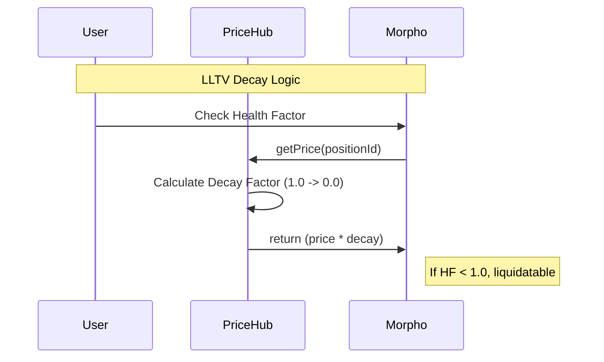
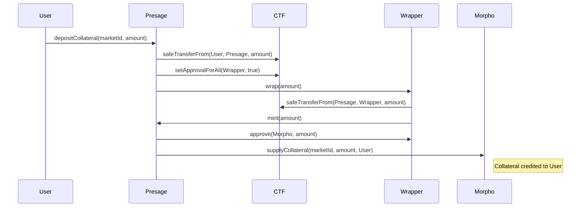
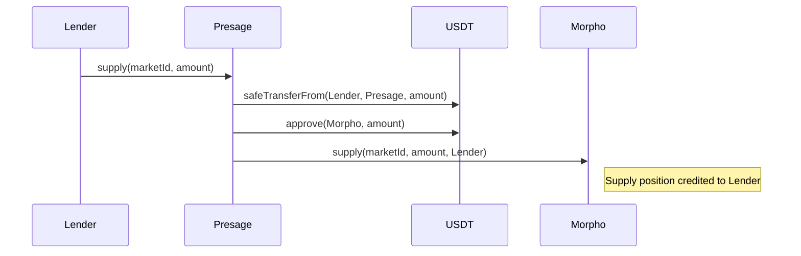
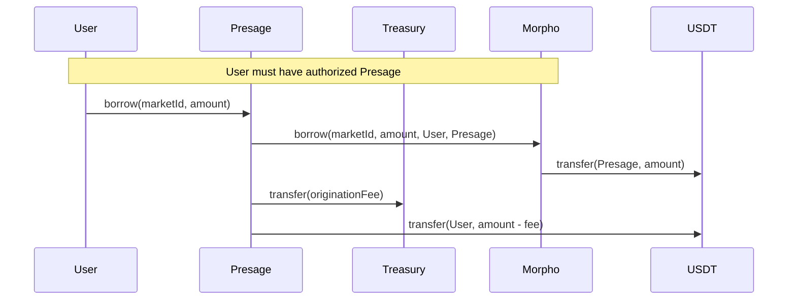
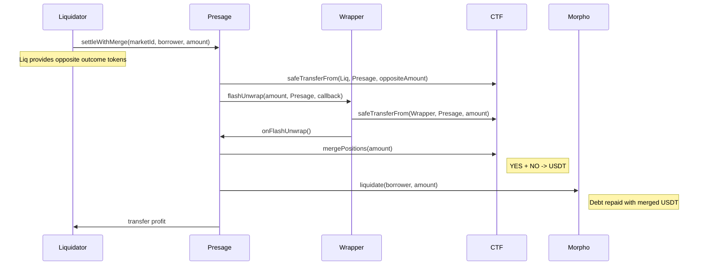
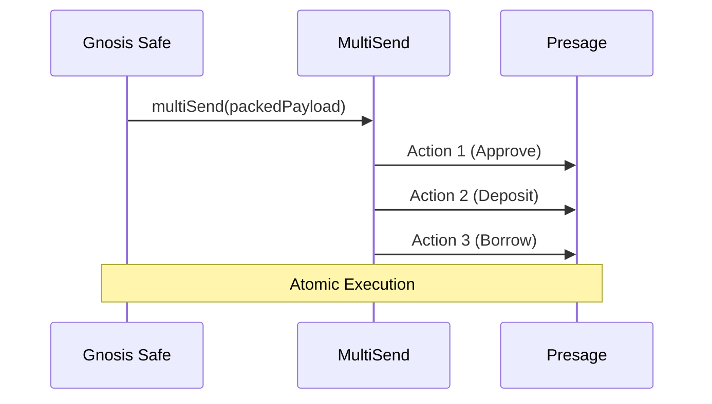

# Presage Protocol — Architecture Guidebook

## What Problem Are We Solving?

Prediction markets (Polymarket, predict.fun, Omen) let you buy outcome tokens — "YES this will happen" or "NO it won't." These tokens are ERC1155 tokens from the Gnosis Conditional Tokens Framework (CTF). If the outcome resolves in your favor, each token pays out $1 in the underlying stablecoin. If not, it's worth $0.

The problem: you believe an outcome is likely, you're holding YES tokens worth $0.80 each, but your capital is locked. You can't use those tokens anywhere else in DeFi because they're ERC1155 — and most DeFi protocols (lending, DEXes, vaults) only work with ERC20 tokens.

Presage solves this by letting you borrow stablecoins against your CTF positions. You keep your prediction market exposure while freeing up liquidity. The protocol wraps CTF tokens into ERC20, deposits them as collateral into Morpho Blue lending markets, and lets you borrow against them.

---

## Why Build on Morpho Blue Instead of Writing Our Own Lending Protocol?

This was the first and most consequential decision. Lending protocols are deceptively complex — interest accrual, share accounting, liquidation incentives, bad debt socialization, flash loans, authorization delegation. Morpho Blue has ~650 lines of battle-tested, formally verified code handling all of this.

What Morpho Blue gives us for free:

- **Interest rate management** via the AdaptiveCurveIRM — automatically adjusts rates based on utilization
- **Liquidation engine** with configurable incentives — we don't write liquidation math
- **Share accounting** for supply/borrow positions — handles rounding edge cases that trip up custom implementations
- **Bad debt socialization** — when a position goes underwater, losses distribute proportionally to lenders in that market
- **Authorization system** — users can delegate position management to contracts like Presage
- **Flash loans** — free, protocol-level flash liquidity

What we had to build ourselves:

- ERC1155→ERC20 wrapping layer (CTF tokens aren't ERC20-compatible)
- Oracle system (no Chainlink feed exists for prediction market probabilities)
- The glue that coordinates wrapping + Morpho interactions in one flow

Morpho Blue's permissionless market creation is the key enabler. Anyone can create an isolated lending market with _any_ ERC20 as collateral — we just need to make CTF tokens look like ERC20, which brings us to wrapping.

---

## The Wrapping Problem: Why ERC1155 → ERC20?

Gnosis CTF tokens are ERC1155. This is a multi-token standard — a single contract holds many different token types, each identified by a `tokenId` (also called `positionId`). When you buy "YES on question X", you receive a balance of token ID `12345` on the CTF contract.

Morpho Blue (and most of DeFi) requires ERC20 — one contract per token type, with `transfer`, `approve`, `balanceOf`, etc.

The wrapper creates a 1:1 bridge between these two worlds. For each CTF position (each unique `positionId`), we deploy a separate ERC20 contract that:

1. **Accepts ERC1155 deposits** via `wrap()` — you send CTF tokens in, it mints an equal amount of ERC20 tokens
2. **Returns ERC1155 on withdrawal** via `unwrap()` — you burn ERC20 tokens, it sends back your CTF tokens
3. **Maintains a strict invariant**: `totalSupply()` of the ERC20 always equals `CTF.balanceOf(wrapper, positionId)`

### WrappedCTF Design Decisions

**Permissionless wrap/unwrap**: The wrapper is fully permissionless. Anyone can wrap. Anyone can unwrap. The wrapper is a pure utility — it doesn't care who calls it or why. This creates a more robust system where users can interact with the wrapper directly (not just through Presage), which is useful for:

- Emergency unwrapping if Presage has issues
- Third-party integrations that want wrapped CTF tokens
- Composability with other DeFi protocols

**EIP-1167 minimal proxy clones**: Each prediction market outcome needs its own wrapper. Deploying a full contract each time costs ~2M gas. Instead, we deploy one implementation contract (`WrappedCTF`) and then create cheap clones (~45k gas) that delegate all logic to it.

**CREATE2 deterministic addresses**: The factory uses `CREATE2` with `keccak256(abi.encode(ctf, positionId))` as the salt. This means you can compute what the wrapper address _will be_ before it's deployed.

**`flashUnwrap()` for atomic liquidations**: Enables temporarily holding raw CTF tokens mid-transaction to perform a merge and settle with stablecoins.

---

## The Oracle Problem: How Do You Price Prediction Market Tokens?

Morpho Blue requires an oracle that implements: `function price() external view returns (uint256);`. No standard price feeds exist for prediction outcomes.

### Pluggable PriceAdapter Interface

Instead of hardcoding one strategy, Presage introduces the `IPriceAdapter` interface:

```solidity
interface IPriceAdapter {
    function getPrice(uint256 positionId) external view returns (uint256 price, uint256 updatedAt);
    function submitPrice(uint256 positionId, bytes calldata data) external;
}
```

1. **FixedPriceAdapter** ($1 fallback) — Every CTF token is priced at its maximum payout. Safe but capital inefficient.
2. **PullPriceAdapter** (Signed Relayer) — Accepts externally-proven prices via `IProofVerifier` backends. Currently uses `SignedProofVerifier` (ECDSA-signed attestations from an authorized relayer fetching predict.fun's API over TLS 1.3). Designed for future upgrade to trustless zkTLS once providers mature.

The `PriceHub` stores these adapters, checks for staleness, and spawns lightweight `MorphoOracleStub` contracts that Morpho recognizes as valid oracles.

---

## LLTV Decay: Approaching Resolution

Prediction tokens can drop to $0 instantly upon resolution. LLTV decay forces deleverage before this happens.



---

## Core Operational Flows

The `Presage` contract orchestrates the interaction between the user, CTF tokens, wrappers, and Morpho Blue.

### 1. Deposit Collateral Flow
Users convert their CTF tokens into collateralized positions on Morpho.



### 2. Lending USDT Flow
Lenders provide the USDT that borrowers use as liquidity.



### 3. Borrow Flow
Users with collateral can borrow USDT. Requires a one-time authorization of Presage on Morpho. An origination fee is deducted before sending funds to the borrower.



### 4. Liquidation: Settle With Merge
The most efficient liquidation path for prediction markets.



---

## MetaMorpho Vault Layer (LP Aggregation)

### The Problem: LP Fragmentation

Each prediction outcome creates a separate isolated Morpho Blue market. An LP who wants to lend USDT must individually call `supply(marketId, amount)` on each market, track different APRs and expiration dates, and manually rotate liquidity as markets resolve and new ones open. With 50-100+ active markets, this is unmanageable for anyone except a sophisticated bot operator.

### The Solution: One Vault, Many Markets

Presage deploys a single **MetaMorpho vault** (Morpho's open-source ERC-4626 vault layer) that accepts USDT deposits and automatically allocates them across Presage's Morpho Blue markets. LPs deposit once, receive a share token (`pUSDT`), and earn blended yield across all active markets without managing individual positions.

```
Presage USDT Vault (one contract, deployed once)
    |
    |-- LP #1 deposits 10k USDT --> gets pUSDT shares
    |-- LP #2 deposits 50k USDT --> gets pUSDT shares
    |-- LP #3 deposits 5k USDT  --> gets pUSDT shares
    |
    |-- Vault allocates total 65k USDT across Presage markets:
        |-- Market #1 (Trump 2028 YES): cap 50k, currently 40k supplied
        |-- Market #2 (BTC >100k Jun): cap 30k, currently 25k supplied
        |-- Market #3 (ETH >5k Dec):   cap 20k, currently 15k supplied
        |-- ... up to 30 markets
        |-- Idle market (unborrrowable): liquidity buffer, earns 0%
```

### How It Works

MetaMorpho vaults interact directly with Morpho Blue — they call `MORPHO.supply()` and `MORPHO.withdraw()`, not `Presage.supply()`. This is correct because `Presage.supply()` was always a thin passthrough to Morpho. **Presage's value is entirely on the borrower/collateral side** — wrapping, oracles, LLTV decay, market creation, and liquidation paths. No one else does this.

The protocol stack becomes:
- **Presage** = borrower infrastructure (markets, wrapping, oracles, liquidation)
- **MetaMorpho** = lender infrastructure (aggregation, curation, set-and-forget)
- **Morpho Blue** = settlement layer (both sides meet here)

Borrowers don't know or care whether the USDT they're borrowing came from the vault or from a direct lender. Morpho Blue treats all supply fungibly within a market.

### Vault Roles

| Role | Who | Powers |
|---|---|---|
| **Owner** | Presage multisig | Set curator, guardian, allocators. Set performance fee (up to 50%). |
| **Curator** | Presage operations address | Enable/disable markets, set per-market supply caps (timelocked increases). |
| **Allocator** | Off-chain Allocator Bot | Rebalance liquidity between markets. Set supply/withdraw queue order. |
| **Guardian** | Safety multisig | Veto risky cap increases or market additions during timelock window. |

### Revenue Model

The vault creates a new revenue stream that Presage doesn't capture today:

| Revenue Stream | Without Vault | With Vault |
|---|---|---|
| Origination fee on borrows | Yes (existing) | Yes (unchanged) |
| Liquidation fee | Yes (existing) | Yes (unchanged) |
| **Cut of LP interest (performance fee)** | **0%** | **Up to 50%** |

### Market Lifecycle in the Vault

1. Presage calls `openMarket()` — creates a new Morpho Blue market with wrapper + oracle
2. Curator calls `submitCap(marketParams, amount)` — proposes enabling the market in the vault with a supply cap
3. After timelock (24h+), anyone calls `acceptCap()` — market is active in the vault
4. Allocator calls `reallocate()` — shifts USDT into the new market from lower-yield markets
5. As the market approaches resolution and LLTV decays, allocator shifts liquidity out
6. After resolution, curator sets cap to 0, allocator withdraws remaining funds, market is removed from withdraw queue

---

## Liquidation Deep-Dive: Two Paths

Liquidation in Presage is not an edge case. Due to LLTV decay, **every borrower who holds to expiry without repaying will be liquidated**. The decay forces this by design:

```
Day 1:    LLTV = 50%, borrower is healthy
Day 5:    LLTV = 40%, borrower must partially repay or face liquidation
Day 8:    LLTV = 20%, almost certainly liquidatable
Day 10:   LLTV = 0%, every position with any debt is liquidatable
```

Three things trigger liquidation:
1. **Price drop** — collateral value falls, health factor drops below 1.0
2. **Interest accrual** — debt grows every block, slowly eroding health factor
3. **LLTV decay** — as resolution approaches, borrowing power decays linearly to 0

### Liquidation Math

**Setup:**
- Borrower deposits 1000 YES tokens as collateral
- Oracle price: YES = $0.80
- LLTV: 50%
- Borrows 400 USDT (max = 1000 x $0.80 x 50%)

**Crisis — YES drops to $0.30:**
- NO rises to $0.70 (market efficiency: YES + NO = $1.00 always)
- Health Factor = (1000 x $0.30 x 0.50) / 400 = 0.375 — liquidatable
- Morpho LIF at 50% LLTV = 1/(1 - 0.3 x 0.5) = 1.176 (17.6% bonus)

**Morpho liquidation math (same for both paths):**
```
Seize:       1000 YES tokens from borrower
Debt repaid  = seizedTokens x oraclePrice / LIF
             = 1000 x $0.30 / 1.176
             = $255.10 of borrower's debt cleared
```

### Path A: settleWithLoanToken

The liquidator pays USDT to Morpho and receives WrappedCTF collateral at a discount.

```
Liquidator pays:      $255.10 USDT to Morpho (repays borrower's debt)
Liquidator receives:  1000 WrappedCTF (YES tokens)
Market value:         1000 x $0.30 = $300
Paper profit:         $300 - $255.10 = $44.90

Problem: Liquidator holds 1000 WrappedCTF with no DEX pool.
         Must unwrap and sell on predict.fun (off-chain, non-atomic).
         Price could drop further before they sell.
         Profit is theoretical until actually sold.
```

### Path B: settleWithMerge

Uses the Gnosis CTF fundamental rule: **1 YES + 1 NO = merge = exactly $1.00 USDT**. This is always true regardless of market price, enforced by the CTF smart contract.

```
Step 1:  Liquidator provides 1000 NO tokens to Presage
         (bought on predict.fun at $0.70 each = $700 cost)

Step 2:  Presage flash-unwraps 1000 YES from borrower's collateral
         (temporarily holds raw YES CTF tokens)

Step 3:  Merge 1000 YES + 1000 NO = 1000 USDT
         (CTF contract guarantees this)

Step 4:  From that $1000 USDT:
         $255.10 repays borrower's debt on Morpho
         $744.90 goes to liquidator

Step 5:  Liquidator P&L:
         Received:  $744.90 USDT
         Cost:      $700.00 (the NO tokens)
         Profit:    $44.90 -- in clean USDT, atomic, one transaction
```

### Path Comparison

| | Path A (USDT) | Path B (Merge) |
|---|---|---|
| Capital needed | $255 USDT | 1000 NO tokens ($700) |
| Liquidator ends with | 1000 illiquid WrappedCTF | $744.90 clean USDT |
| Profit | $44.90 (paper, must sell) | $44.90 (realized, settled) |
| Atomic? | Yes, but stuck with illiquid token | Yes, fully settled in USDT |
| Risk after liquidation | YES could drop further | None |

### Path to Third-Party Liquidators

At launch, the Presage Safety Bot is the sole liquidator. Over time, third-party liquidators emerge through the merge path because:

- **Market makers** hold both YES and NO tokens as trading inventory — they already have opposite tokens at zero marginal cost
- **NO holders** can use their position productively when YES is crashing — the people winning on the other side are natural liquidators
- **The merge path is genuinely profitable** with atomic USDT settlement, no illiquid token risk

---

## Operational Infrastructure: Required Bots

Presage requires three continuously-running off-chain processes. They can share a single server but serve distinct purposes.

### Bot #1: Price Keeper

| | |
|---|---|
| **Purpose** | Keep oracle prices fresh so Morpho operations don't freeze |
| **Frequency** | Every ~30 minutes (within maxStaleness window) |
| **Calls** | `submitPrice()` on PullPriceAdapter via SignedProofVerifier |
| **Needs funded wallet?** | Gas only (BNB) |
| **If it stops** | Protocol freezes — no borrows, no liquidations, bad debt accumulates silently |
| **Criticality** | **P0 — launch blocker** |

### Bot #2: Safety Bot (Liquidation Keeper)

| | |
|---|---|
| **Purpose** | Liquidate underwater borrowers to prevent bad debt |
| **Frequency** | Every ~1 minute (scan all positions) |
| **Calls** | `settleWithMerge()`, `settleWithLoanToken()` |
| **Needs funded wallet?** | Yes — USDT for Path A, opposite CTF tokens for Path B, BNB for gas |
| **If it stops** | Underwater positions accumulate bad debt, socialized to lenders |
| **Criticality** | **P0 — launch blocker** |

### Bot #3: Allocator Bot (Vault Rebalancer)

| | |
|---|---|
| **Purpose** | Rebalance vault USDT across markets for optimal yield |
| **Frequency** | Every few hours, or on market open/close events |
| **Calls** | `reallocate()`, `setSupplyQueue()`, `updateWithdrawQueue()` |
| **Needs funded wallet?** | Gas only (BNB) — moves the vault's own USDT |
| **If it stops** | Yield drops, liquidity sits idle in expiring markets. No funds lost. |
| **Criticality** | **P1 — high priority, not safety-critical** |

### What Happens If Bots Go Down

| Scenario | Impact |
|---|---|
| Price Keeper down 1 hour | Oracle goes stale, all Morpho operations freeze, no liquidations possible |
| Safety Bot down 1 hour | Positions that crossed HF < 1.0 accumulate bad debt |
| Safety Bot down 24h near resolution | LLTV has decayed, multiple positions underwater, resolution hits, collateral goes to $0, lenders lose money |
| Allocator Bot down 24 hours | Yield is suboptimal, some funds idle. No safety impact. |
| All bots down | Protocol is effectively frozen and accumulating bad debt. Emergency scenario. |

The Price Keeper and Safety Bot are **as critical as the smart contracts themselves**. The protocol cannot safely hold user funds without them running.

---

## Safe Wallet Integration

`SafeBatchHelper` encodes atomic operations for Gnosis Safe users.



---

## Operational Infrastructure

Presage's smart contracts define the rules, but safe operation requires off-chain infrastructure that runs continuously.

### Safety Bot (Liquidation Keeper)
A lending protocol requires an active liquidation process. Standard Morpho Blue MEV searchers cannot profitably liquidate prediction market collateral — WrappedCTF tokens have no DEX liquidity, and predict.fun's orderbook is off-chain and non-atomic. Presage must operate its own **Safety Bot** that:

- Monitors all borrower positions for health factor < 1.0
- Executes `settleWithLoanToken()` or `settleWithMerge()` when positions become liquidatable
- Requires a funded wallet (USDT for Path A, opposite-outcome CTF tokens for Path B)

### Price Keeper
Presage uses pull oracles — prices must be submitted with proofs. If nobody updates the oracle within `maxStaleness` (default: 1 hour), `PriceHub.morphoPrice()` reverts, freezing all Morpho operations including liquidations. A **Price Keeper** must:

- Submit fresh oracle proofs on a schedule (via `SignedProofVerifier` or `ReclaimVerifier`)
- Run continuously — if it stops, the protocol freezes and bad debt can accumulate silently

Both services can run as a single off-chain process. See `docs/pre-launch-build-list.md` for full specifications.

---

## Risk Model Summary

| Risk | Severity | Mitigation |
|---|---|---|
| No liquidation bot | Critical | Build and fund a Safety Bot before launch |
| Oracle goes stale | Critical | Build a Price Keeper that submits proofs on schedule |
| Resolution risk | Critical | LLTV decay + mandatory cooldown window |
| Wrapper bug | High | Minimal, immutable code; permissionless design |
| Oracle manipulation | Medium-High | Fixed-price fallback + pull-oracle staleness checks |
| Bad debt | Medium | Isolated markets + Morpho socialization |

---

## File Map

```
contracts/
├── Presage.sol              # Router: market creation, supply/borrow/repay, liquidation, per-market fees
├── WrappedCTF.sol           # Permissionless ERC20 ↔ ERC1155 wrapper
├── WrapperFactory.sol       # EIP-1167 clone factory with CREATE2
├── PriceHub.sol             # Oracle registry + decay + Morpho stub spawning
├── SafeBatchHelper.sol      # Encodes Safe multiSend payloads
├── interfaces/
│   ├── ICTF.sol             # Gnosis Conditional Tokens interface
│   └── IPriceAdapter.sol    # Pluggable oracle backend interface
├── oracle/
│   ├── FixedPriceAdapter.sol    # $1 always (v1 default)
│   ├── PullPriceAdapter.sol     # Accepts proven price observations
│   ├── ReclaimVerifier.sol      # zkTLS proof verifier (Reclaim Protocol)
│   └── SignedProofVerifier.sol  # ECDSA-signed attestation verifier
```
