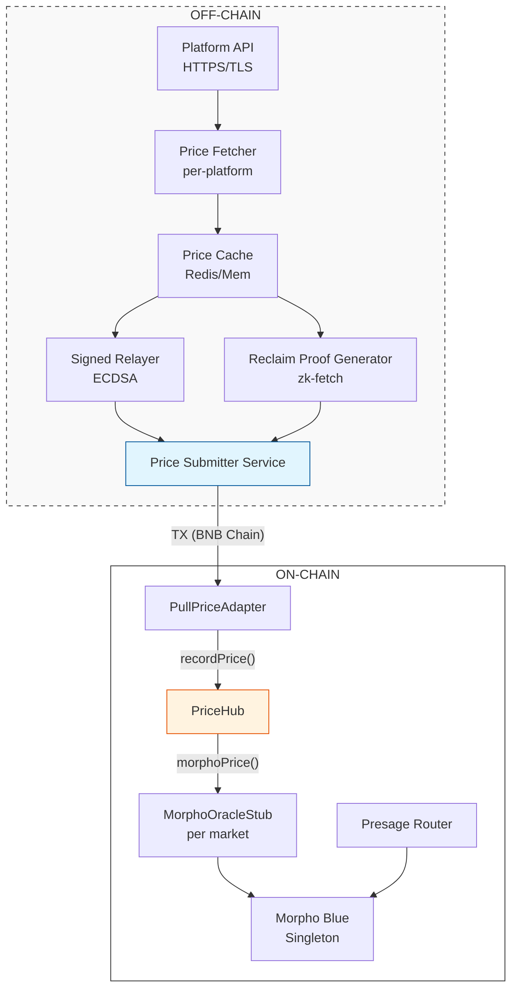

# New Prediction Market Platform — Setup Guide

This guide walks through every step required to integrate a new prediction market platform (e.g., Polymarket, OPINION, Azuro) with the Presage Protocol. By the end, users will be able to borrow USDT against that platform's CTF tokens with live oracle pricing.

---

## Table of Contents

1. [Architecture Overview](#1-architecture-overview)
2. [Prerequisites](#2-prerequisites)
3. [Phase 1: Platform Research](#3-phase-1-platform-research)
4. [Phase 2: Oracle Configuration (On-Chain)](#4-phase-2-oracle-configuration-on-chain)
5. [Phase 3: Microservice Architecture (Off-Chain)](#5-phase-3-microservice-architecture-off-chain)
6. [Phase 4: Opening Markets](#6-phase-4-opening-markets)
7. [Phase 5: Testing](#7-phase-5-testing)
8. [Phase 6: Monitoring & Maintenance](#8-phase-6-monitoring--maintenance)
9. [Tips for Reliable Onboarding](#9-tips-for-reliable-onboarding)
10. [Appendix: Platform Checklist](#10-appendix-platform-checklist)

---

## 1. Architecture Overview

### End-to-End System



### What Gets Deployed Per-Platform vs Per-Market

| Component                          | Scope                                           | Deploy When                          |
| ---------------------------------- | ----------------------------------------------- | ------------------------------------ |
| Presage, PriceHub, WrapperFactory  | **Global singleton**                            | Once (already deployed)              |
| PullPriceAdapter                   | **Per platform** (or shared)                    | Once per platform, or reuse existing |
| SignedProofVerifier                | **Per platform** (one relayer key per platform) | Once per platform                    |
| ReclaimVerifier                    | **Global singleton** (platform-agnostic)        | Once (shared across all platforms)   |
| ReclaimVerifier endpoint + mapping | **Per platform + per market**                   | Config tx per market                 |
| MorphoOracleStub                   | **Per market**                                  | Auto-created by `openMarket()`       |
| WrappedCTF                         | **Per CTF position**                            | Auto-created by `openMarket()`       |
| Price Fetcher microservice         | **Per platform**                                | Deploy one service per platform API  |
| Price Submitter                    | **Global**                                      | One service submits for all markets  |

---

## 2. Prerequisites

### Deployed Infrastructure

These should already exist on BNB mainnet. If not, run `npx hardhat run deploy.ts --network bnb`.

| Contract          | Address                                      |
| ----------------- | -------------------------------------------- |
| Presage           | `0x4d2C98FF3349A71FD4756A3E5dBb987779Fbd48f` |
| PriceHub          | `0xA0b5248b0Cf37B211C34FED77044984F1757835c` |
| WrapperFactory    | `0x8Aa2713b0657C87A73aca697C3f5cb29e31b1244` |
| Morpho Blue       | `0x01b0Bd309AA75547f7a37Ad7B1219A898E67a83a` |
| IRM               | `0x7112D95cB5f6b13bF5F5B94a373bB3b2B381F979` |
| Reclaim Singleton | `0x5917FaB4808A119560dfADc14F437ae1455AEd40` |

### Required Accounts & Keys

- **Deployer wallet** — Owner of Presage, PriceHub, and adapter contracts. Has BNB for gas.
- **Relayer wallet** — Dedicated key for signing price attestations (for SignedProofVerifier). Should NOT be the deployer.
- **Reclaim app credentials** — APP_ID and APP_SECRET from [dev.reclaimprotocol.org](https://dev.reclaimprotocol.org). Enable zk-fetch on the developer portal.
- **Platform API key** — API credentials for the new prediction market platform (if their API requires authentication).

### Required Information From the Platform

Before starting, gather this from the platform's documentation or contracts:

| Item                     | Description                                       | Example (predict.fun)                               |
| ------------------------ | ------------------------------------------------- | --------------------------------------------------- |
| **CTF contract address** | Gnosis CTF (ERC1155) on BNB Chain                 | `0x...`                                             |
| **Price API endpoint**   | HTTPS endpoint returning market prices            | `https://api.predict.fun/v1/markets/{id}/orderbook` |
| **API authentication**   | Headers, API keys, or none                        | `x-api-key: <key>`                                  |
| **Response format**      | JSON structure containing the price field         | `{"data":{"lastOrderSettled":{"price":"0.65"}}}`    |
| **Market ID format**     | How markets are identified in the URL             | Numeric ID (`900`) or slug                          |
| **Position IDs**         | CTF position IDs for YES and NO tokens per market | `positionId: 123456...`                             |
| **Condition ID**         | Gnosis CTF condition hash                         | `0xabc123...`                                       |
| **Resolution date**      | When the market resolves                          | Unix timestamp                                      |

---

## 3. Phase 1: Platform Research

### 3.1 Identify the Price API Endpoint

Find the endpoint that returns the current market price/probability. You need:

1. **A stable URL pattern** with the market ID as a path or query parameter
2. **A JSON response** containing a price/probability field
3. **HTTPS** — must be accessible via TLS (any version)

**Examples from known platforms:**

| Platform    | Endpoint Pattern                   | Price Location                |
| ----------- | ---------------------------------- | ----------------------------- |
| predict.fun | `GET /v1/markets/{id}/orderbook`   | `data.lastOrderSettled.price` |
| OPINION     | `GET /openapi/price?token_id={id}` | `price`                       |
| Polymarket  | `GET /markets/{id}`                | `outcomePrices[0]`            |

### 3.2 Test the API Manually

```bash
# Test the endpoint (replace with actual platform URL)
curl -s "https://api.newplatform.com/v1/markets/123" \
  -H "Authorization: Bearer YOUR_API_KEY" | jq .
```

Note the exact JSON path to the price field. You'll need this for both the relayer bot and the zk-fetch regex.

### 3.3 Design the zk-fetch Regex

The regex must capture a named group called `price` from the API response. This is what ReclaimVerifier extracts on-chain.

```
# For a response like: {"price":"0.65","volume":1000}
"price":"(?<price>[\d.]+)"

# For nested: {"data":{"lastOrderSettled":{"price":"0.09"}}}
"lastOrderSettled":\{[^}]*"price":"(?<price>[\d.]+)"

# For array: {"outcomePrices":["0.65","0.35"]}
"outcomePrices":\["(?<price>[\d.]+)"
```

### 3.4 Test zk-fetch Proof Generation

Create a test script modeled after `scripts/reclaim-proof-test.ts`:

```typescript
import { ReclaimClient } from "@reclaimprotocol/zk-fetch";
import { verifyProof, transformForOnchain } from "@reclaimprotocol/js-sdk";

const APP_ID = "your-reclaim-app-id";
const APP_SECRET = "your-reclaim-app-secret";

const client = new ReclaimClient(APP_ID, APP_SECRET, true);

const proof = await client.zkFetch(
  "https://api.newplatform.com/v1/markets/123",
  {
    method: "GET",
    headers: { accept: "application/json" },
  },
  {
    // Private: hidden from the proof
    headers: { Authorization: "Bearer YOUR_API_KEY" },
    // Public: visible in the proof, captures the price
    responseMatches: [
      {
        type: "regex",
        value: '"price":"(?<price>[\\d.]+)"',
      },
    ],
    responseRedactions: [
      {
        regex: '"price":"(?<price>[\\d.]+)"',
      },
    ],
  },
);

const isValid = await verifyProof(proof);
console.log("Valid:", isValid);
console.log("Price:", proof.extractedParameterValues.price);
```

Run with: `npx ts-node scripts/test-newplatform-proof.ts`

If this succeeds, the platform is compatible with Reclaim. If it fails (TLS error, timeout), fall back to signed relayer only.

### 3.5 Get CTF Position IDs

Each market has a YES token and a NO token, each identified by a `positionId` (uint256). These come from the Gnosis CTF contract on BNB Chain.

How to find them depends on the platform:

- **Platform API** — Some platforms expose position IDs in their market data
- **Platform contracts** — Read from the platform's market factory or registry
- **Gnosis CTF directly** — Call `ctf.getPositionId(collateralToken, collectionId)` with the condition ID and outcome index

```typescript
// Example: computing positionId from Gnosis CTF
const conditionId = "0xabc123...";
const parentCollectionId = ethers.ZeroHash; // base-level market
const indexSet = 1; // YES = 1, NO = 2

const collectionId = await ctf.getCollectionId(
  parentCollectionId,
  conditionId,
  indexSet,
);
const positionId = await ctf.getPositionId(collateralToken, collectionId);
```

---

## 4. Phase 2: Oracle Configuration (On-Chain)

### 4.1 Deployment Strategy: Shared vs. New Contracts

When onboarding a new platform, you must decide which components to reuse and which to deploy fresh.

#### Reclaim (zkTLS) Verifier: **Global Singleton**
You **do not** need to deploy a new `ReclaimVerifier` for each platform. It is designed as a platform-agnostic singleton.
*   **How it handles different endpoints**: You call `addEndpoint("https://api.newplatform.com/v1/markets/")` to whitelist the new platform's API prefix.
*   **How it handles different structures**: The JSON parsing (Regex) is handled **off-chain** by the Reclaim witness network. As long as your off-chain service captures the price into a named group called `price`, the on-chain verifier extracts it generically.
*   **Market Mapping**: You call `mapPosition(endpointPrefix, marketId, positionId)` to map a specific market identifier in a URL to its CTF token.

#### Signed Proof Verifier: **Per-Platform (Recommended)**
For the signed path, it is best practice to deploy a **new** `SignedProofVerifier` for each platform.
*   **Trust Boundaries**: This allows each platform to use a unique relayer key. If one platform's key is compromised, you can rotate it without affecting others.
*   **Isolation**: It ensures that a relayer for Platform A cannot accidentally (or maliciously) sign a price update for Platform B's position IDs.

#### PullPriceAdapter: **Shared (Recommended)**
The `PullPriceAdapter` acts as a router that delegates to authorized verifiers.
*   **Option A: Shared Adapter**: Reuse the existing adapter and call `setVerifier(newSignedVerifier, true)`. This is the most gas-efficient path for scaling.
*   **Option B: Separate Adapter**: Deploy a new adapter if you want complete isolation (e.g., if a platform requires custom staleness or update logic).

---

### 4.2 Deploy or Reuse SignedProofVerifier

Each platform needs its own relayer key (separation of trust). Deploy a new SignedProofVerifier with that platform's relayer address:

```bash
# Set env vars
export PRICE_HUB_ADDR=0xA0b5248b0Cf37B211C34FED77044984F1757835c
export VERIFIER_MODE=signed
export RELAYER_ADDR=0xNewPlatformRelayerAddress

npx hardhat run scripts/launch-predict-fun.ts --network bnb
```

Or deploy manually:

```typescript
const SignedProofVerifier = await ethers.getContractFactory(
  "SignedProofVerifier",
);
const verifier = await SignedProofVerifier.deploy(relayerAddress);
await verifier.waitForDeployment();
```

### 4.3 Configure ReclaimVerifier for the New Platform

ReclaimVerifier is platform-agnostic — a single deployment serves all platforms. You just add endpoint prefixes and position mappings.

**Step 1: Add the endpoint prefix**

The prefix is everything in the URL before the market identifier.

```typescript
const rv = await ethers.getContractAt("ReclaimVerifier", RECLAIM_VERIFIER_ADDR);

// The prefix must end right where the market ID begins
await rv.addEndpoint("https://api.newplatform.com/v1/markets/");
// This matches URLs like:
//   https://api.newplatform.com/v1/markets/123/orderbook
//   https://api.newplatform.com/v1/markets/456
// Market ID extracted: "123", "456" (everything between prefix and next /, ?, &, or ")
```

**Step 2: Map each market to its CTF positionId**

```typescript
// For each market you want to support:
await rv.mapPosition(
  "https://api.newplatform.com/v1/markets/", // endpoint prefix (must match exactly)
  "123", // market ID as it appears in the URL
  BigInt("98765432109876543210"), // CTF positionId (YES token)
);
```

Repeat for every market on this platform.

### 4.4 Authorize Verifiers in PullPriceAdapter

```typescript
const adapter = await ethers.getContractAt("PullPriceAdapter", ADAPTER_ADDR);

// Authorize the new signed verifier (if deploying a new one)
await adapter.setVerifier(newSignedVerifierAddr, true);

// ReclaimVerifier should already be authorized (it's shared)
// If not:
await adapter.setVerifier(reclaimVerifierAddr, true);
```

### 4.5 Register Adapter in PriceHub

For each position ID on the new platform, register the adapter:

```typescript
const hub = await ethers.getContractAt("PriceHub", PRICE_HUB_ADDR);

// Register adapter for this specific position
await hub.setAdapter(positionId, adapterAddress);
```

### 4.6 Automated Setup via launch-predict-fun.ts

The script `scripts/launch-predict-fun.ts` handles steps 4.2–4.5 in one command. Despite the name, it is a **generic platform onboarding template** that uses environment variables for flexibility:

```bash
# Oracle Phase Deployment
export PRICE_HUB_ADDR=0xA0b5248b0Cf37B211C34FED77044984F1757835c
export VERIFIER_MODE=both
export RELAYER_ADDR=0xNewPlatformRelayerAddress
export RECLAIM_ADDR=0x5917FaB4808A119560dfADc14F437ae1455AEd40
export ENDPOINT_PREFIX="https://api.predict.fun/v1/markets/"
export MARKET_ID=123
export YES_POSITION_ID=98765432109876543210
export INITIAL_PRICE=0.50

npx hardhat run scripts/launch-predict-fun.ts --network bnb
```


---

## 5. Phase 3: Microservice Architecture (Off-Chain)

Three services work together to keep oracle prices fresh:

```
┌─────────────────────────────────────────────────────────────┐
│                    MICROSERVICES                             │
│                                                             │
│  ┌─────────────────┐                                        │
│  │  Price Fetcher   │  1 instance per platform              │
│  │  (platform-      │  Polls API every N seconds            │
│  │   specific)      │  Normalizes response to {price, ts}   │
│  └────────┬────────┘                                        │
│           │ POST /price { platform, marketId, price }       │
│           ▼                                                 │
│  ┌─────────────────────────────────────────────────┐        │
│  │  Oracle Hub Service                              │        │
│  │  (shared, platform-agnostic)                     │        │
│  │                                                  │        │
│  │  Routes to proof generators:                     │        │
│  │  ┌───────────────┐  ┌────────────────────┐      │        │
│  │  │ Signed Relayer │  │ Reclaim Proof Gen  │      │        │
│  │  │ (ECDSA sign)   │  │ (zk-fetch call)    │      │        │
│  │  └───────┬───────┘  └────────┬───────────┘      │        │
│  │          │                   │                   │        │
│  │          ▼                   ▼                   │        │
│  │  ┌─────────────────────────────────────┐        │        │
│  │  │ Price Submitter                      │        │        │
│  │  │ Encodes proof → sends TX on-chain    │        │        │
│  │  └─────────────────────────────────────┘        │        │
│  └─────────────────────────────────────────────────┘        │
└─────────────────────────────────────────────────────────────┘
```

### 5.1 Price Fetcher (Per-Platform)

Each platform has different API endpoints, authentication, and response formats. Write one small fetcher per platform.

**Responsibilities:**

- Poll the platform's API at a configurable interval (e.g., every 30 seconds)
- Extract the price from the platform-specific JSON structure
- Normalize to a standard format: `{ platform, marketId, price, timestamp }`
- Push to the Oracle Hub Service

**Example: predict.fun fetcher**

```typescript
// services/fetchers/predict-fun.ts

const ENDPOINT = "https://api.predict.fun/v1/markets";
const API_KEY = process.env.PREDICT_API_KEY;

interface NormalizedPrice {
  platform: string;
  marketId: string;
  price: string; // decimal string, e.g. "0.65"
  timestamp: number; // unix seconds
}

async function fetchPrice(marketId: string): Promise<NormalizedPrice> {
  const res = await fetch(`${ENDPOINT}/${marketId}/orderbook`, {
    headers: {
      accept: "application/json",
      "x-api-key": API_KEY,
    },
  });

  const json = await res.json();
  const price = json.data.lastOrderSettled.price;

  return {
    platform: "predict-fun",
    marketId,
    price,
    timestamp: Math.floor(Date.now() / 1000),
  };
}
```

**Example: new platform fetcher**

```typescript
// services/fetchers/new-platform.ts

async function fetchPrice(marketId: string): Promise<NormalizedPrice> {
  const res = await fetch(
    `https://api.newplatform.com/v1/markets/${marketId}`,
    {
      headers: { Authorization: `Bearer ${process.env.NEWPLATFORM_API_KEY}` },
    },
  );

  const json = await res.json();
  // Adapt to this platform's response structure
  const price = json.market.probability;

  return {
    platform: "new-platform",
    marketId,
    price: price.toString(),
    timestamp: Math.floor(Date.now() / 1000),
  };
}
```

### 5.2 Oracle Hub Service (Shared, Platform-Agnostic)

Central service that receives normalized prices and generates proofs via both paths.

**Responsibilities:**

- Receive price updates from all platform fetchers
- Maintain a registry of `{ platform, marketId } → { positionId, endpoint, relayerKey }`
- Generate signed proofs (ECDSA) for the signed relayer path
- Generate Reclaim proofs (zk-fetch) for the zkTLS path
- Queue proofs for on-chain submission

**Configuration file:**

```json
{
  "markets": [
    {
      "platform": "predict-fun",
      "marketId": "900",
      "positionId": "98765432109876543210",
      "endpointPrefix": "https://api.predict.fun/v1/markets/",
      "apiUrl": "https://api.predict.fun/v1/markets/900/orderbook",
      "priceJsonPath": "data.lastOrderSettled.price",
      "zkFetchRegex": "\"lastOrderSettled\":\\{[^}]*\"price\":\"(?<price>[\\d.]+)\"",
      "updateIntervalSeconds": 60,
      "verifierMode": "both"
    },
    {
      "platform": "new-platform",
      "marketId": "123",
      "positionId": "11111111111111111111",
      "endpointPrefix": "https://api.newplatform.com/v1/markets/",
      "apiUrl": "https://api.newplatform.com/v1/markets/123",
      "priceJsonPath": "market.probability",
      "zkFetchRegex": "\"probability\":\"(?<price>[\\d.]+)\"",
      "updateIntervalSeconds": 60,
      "verifierMode": "both"
    }
  ]
}
```

### 5.3 Signed Relayer Module

Generates ECDSA-signed price attestations.

```typescript
// services/proofs/signed-relayer.ts
import { ethers } from "ethers";

const relayerWallet = new ethers.Wallet(process.env.RELAYER_PRIVATE_KEY);

async function generateSignedProof(
  timestamp: number,
  positionId: bigint,
  priceWad: bigint,
): Promise<string> {
  // 1. Hash the attestation
  const msgHash = ethers.solidityPackedKeccak256(
    ["uint256", "uint256", "uint256"],
    [timestamp, positionId, priceWad],
  );

  // 2. Sign with relayer key
  const signature = await relayerWallet.signMessage(ethers.getBytes(msgHash));

  // 3. Encode as proof bytes
  const proof = ethers.AbiCoder.defaultAbiCoder().encode(
    ["uint256", "uint256", "uint256", "bytes"],
    [timestamp, positionId, priceWad, signature],
  );

  // 4. Wrap with verifier address for PullPriceAdapter
  return ethers.AbiCoder.defaultAbiCoder().encode(
    ["address", "bytes"],
    [SIGNED_VERIFIER_ADDR, proof],
  );
}
```

### 5.4 Reclaim Proof Generator Module

Generates zkTLS proofs via zk-fetch. This is the trustless path.

```typescript
// services/proofs/reclaim-generator.ts
import { ReclaimClient } from "@reclaimprotocol/zk-fetch";
import { transformForOnchain } from "@reclaimprotocol/js-sdk";
import { ethers } from "ethers";

const client = new ReclaimClient(APP_ID, APP_SECRET, true);

async function generateReclaimProof(market: MarketConfig): Promise<string> {
  // 1. Generate zk-fetch proof
  const proof = await client.zkFetch(
    market.apiUrl,
    {
      method: "GET",
      headers: { accept: "application/json" },
    },
    {
      headers: market.privateHeaders, // API key hidden from proof
      responseMatches: [{ type: "regex", value: market.zkFetchRegex }],
      responseRedactions: [{ regex: market.zkFetchRegex }],
    },
  );

  if (!proof) throw new Error("zk-fetch returned null");

  // 2. Transform to on-chain format
  const onchain = transformForOnchain(proof);

  // 3. ABI-encode as ReclaimProof struct
  const proofBytes = ethers.AbiCoder.defaultAbiCoder().encode(
    [
      "tuple(tuple(string,string,string),tuple(tuple(bytes32,address,uint32,uint32),bytes[]))",
    ],
    [
      [
        [
          onchain.claimInfo.provider,
          onchain.claimInfo.parameters,
          onchain.claimInfo.context,
        ],
        [
          [
            onchain.signedClaim.claim.identifier,
            onchain.signedClaim.claim.owner,
            onchain.signedClaim.claim.timestampS,
            onchain.signedClaim.claim.epoch,
          ],
          onchain.signedClaim.signatures,
        ],
      ],
    ],
  );

  // 4. Wrap with verifier address for PullPriceAdapter
  return ethers.AbiCoder.defaultAbiCoder().encode(
    ["address", "bytes"],
    [RECLAIM_VERIFIER_ADDR, proofBytes],
  );
}
```

### 5.5 Price Submitter (Shared)

Submits encoded proofs on-chain. One instance serves all platforms and markets.

```typescript
// services/submitter.ts
import { ethers } from "ethers";

const provider = new ethers.JsonRpcProvider(BNB_RPC_URL);
const submitter = new ethers.Wallet(SUBMITTER_PRIVATE_KEY, provider);
const adapter = new ethers.Contract(
  ADAPTER_ADDR,
  PullPriceAdapterABI,
  submitter,
);

async function submitProof(positionId: bigint, encodedData: string) {
  try {
    const tx = await adapter.submitPrice(positionId, encodedData);
    const receipt = await tx.wait();
    console.log(
      `Submitted price for position ${positionId} — gas: ${receipt.gasUsed}`,
    );
  } catch (err: any) {
    // Common expected errors:
    if (err.message.includes("not newer")) {
      console.log("Price not newer than cached — skipping");
      return;
    }
    throw err;
  }
}
```

**Note:** The submitter wallet does NOT need to be the relayer or deployer. Anyone can call `submitPrice()` — the proof is what matters, not who submits it.

### 5.6 Proof Strategy: Signed vs Reclaim vs Both

| Strategy               | Gas Cost          | Trust                       | Latency      | Reliability                   |
| ---------------------- | ----------------- | --------------------------- | ------------ | ----------------------------- |
| **Signed only**        | ~150k gas         | Centralized (relayer key)   | Fast (< 1s)  | High (standard HTTPS)         |
| **Reclaim only**       | ~600k gas         | Trustless (witness network) | Slow (5-30s) | Medium (witness availability) |
| **Both** (recommended) | Choose per-update | Best of both                | Varies       | Highest                       |

**Recommended approach:** Submit signed proofs on the regular interval (fast, cheap). Submit Reclaim proofs less frequently (e.g., every 5 minutes) as trustless anchors. If the signed relayer goes down, Reclaim continues. If Reclaim witnesses fail, the signed relayer continues.

---

## 6. Phase 4: Opening Markets

Once oracle infrastructure is configured, open lending markets in Presage.

### 6.1 Seed the Initial Price

Before opening a market, PriceHub needs an initial price:

```typescript
const hub = await ethers.getContractAt("PriceHub", PRICE_HUB_ADDR);
await hub.seedPrice(positionId, ethers.parseUnits("0.50", 18)); // 50% initial probability
```

### 6.2 Open the Market

```typescript
const presage = await ethers.getContractAt("Presage", PRESAGE_ADDR);

const marketId = await presage.openMarket(
  {
    ctf: CTF_ADDRESS, // Gnosis CTF contract
    parentCollectionId: ethers.ZeroHash, // base-level market
    conditionId: CONDITION_ID, // market condition hash
    positionId: YES_POSITION_ID, // YES token ID
    oppositePositionId: NO_POSITION_ID, // NO token ID (for merge liquidation)
  },
  USDT_ADDRESS, // loan token
  ethers.parseUnits("0.77", 18), // 77% LLTV
  RESOLUTION_TIMESTAMP, // when market resolves (unix)
  86400, // decayDuration: 24 hours
  3600, // decayCooldown: 1 hour before resolution
);

console.log(`Market opened: ID ${marketId}`);
```

**What `openMarket()` does internally:**

1. Creates a WrappedCTF (ERC20 wrapper) for the YES position via WrapperFactory
2. Spawns a MorphoOracleStub via PriceHub for this position
3. Creates an isolated Morpho Blue lending market with the wrapper as collateral
4. Stores the full market configuration (CTF position, resolution params)

### 6.3 Verify the Market

```typescript
// Check the market was created correctly
const market = await presage.getMarket(marketId);
console.log("Loan token:", market.morphoParams.loanToken);
console.log("Collateral:", market.morphoParams.collateralToken); // WrappedCTF address
console.log("Oracle:", market.morphoParams.oracle); // MorphoOracleStub address
console.log("LLTV:", ethers.formatUnits(market.morphoParams.lltv, 18));
console.log("Position ID:", market.ctfPosition.positionId);
console.log(
  "Resolution:",
  new Date(Number(market.ctfPosition.resolutionAt) * 1000),
);

// Check price is live
const [price, updatedAt] = await hub.prices(YES_POSITION_ID);
console.log("Current price:", ethers.formatUnits(price, 18));
console.log("Last updated:", new Date(Number(updatedAt) * 1000));
```

---

## 7. Phase 5: Testing

### 7.1 Fork Test: Full Oracle Pipeline

Run the Reclaim end-to-end test to verify proof generation and on-chain verification:

```bash
FORK_BNB=true npx hardhat test test/ReclaimVerifier.test.ts
```

This test (see `test/ReclaimVerifier.test.ts`):

1. Generates a real zk-fetch proof from predict.fun
2. Deploys PriceHub + ReclaimVerifier + PullPriceAdapter on a BNB fork
3. Configures endpoint prefix and position mapping
4. Submits the proof through the full pipeline
5. Verifies the price is recorded in PriceHub

### 7.2 Fork Test: Full Lending Pipeline

Adapt the existing fork test to include the new platform's market:

```bash
FORK_BNB=true npx hardhat test test/Presage.fork.test.ts
```

Key things to verify:

- `openMarket()` succeeds with new platform's CTF position
- `depositCollateral()` wraps the CTF tokens correctly
- `borrow()` works against the collateral
- `healthFactor()` returns correct values based on oracle price
- `settleWithMerge()` liquidation works with the opposite position

### 7.3 Test Price Submission Manually

Before deploying microservices, test proof submission manually:

**Signed relayer test:**

```typescript
const ts = Math.floor(Date.now() / 1000);
const price = ethers.parseUnits("0.65", 18);
const msgHash = ethers.solidityPackedKeccak256(
  ["uint256", "uint256", "uint256"],
  [ts, positionId, price],
);
const sig = await relayerSigner.signMessage(ethers.getBytes(msgHash));
const proof = abiCoder.encode(
  ["uint256", "uint256", "uint256", "bytes"],
  [ts, positionId, price, sig],
);
const data = abiCoder.encode(["address", "bytes"], [signedVerifierAddr, proof]);

await adapter.submitPrice(positionId, data);
```

**Reclaim test:**

```bash
npx ts-node scripts/reclaim-proof-test.ts <marketId>
```

### 7.4 Integration Checklist

Before going live, verify each step:

- [ ] Platform API responds correctly
- [ ] zk-fetch proof generation succeeds
- [ ] ReclaimVerifier endpoint is registered
- [ ] ReclaimVerifier position mapping is correct
- [ ] SignedProofVerifier accepts relayer signatures
- [ ] PullPriceAdapter has both verifiers authorized
- [ ] PriceHub has adapter registered for the position ID
- [ ] Price submission works (both signed and Reclaim)
- [ ] PriceHub records the price correctly
- [ ] `openMarket()` succeeds
- [ ] Deposit, borrow, repay, and liquidation flows work
- [ ] Health factor reflects oracle price changes
- [ ] LLTV decay activates at the correct time before resolution

---

## 8. Phase 6: Monitoring & Maintenance

### 8.1 Key Metrics to Monitor

| Metric                              | Alert Threshold                 | Action                                                 |
| ----------------------------------- | ------------------------------- | ------------------------------------------------------ |
| Price staleness                     | > `maxStaleness` (e.g., 1 hour) | Check microservices, restart fetcher/submitter         |
| Reclaim proof failures              | > 3 consecutive                 | Check witness network status, verify TLS compatibility |
| Gas balance (submitter)             | < 0.01 BNB                      | Top up submitter wallet                                |
| Price deviation (signed vs Reclaim) | > 5%                            | Investigate data source discrepancy                    |
| Health factors approaching 1.0      | Any user < 1.1                  | Monitor for liquidation opportunities                  |

### 8.2 Adding New Markets on an Existing Platform

Once a platform is integrated, adding a new market is lightweight:

```typescript
// 1. Map the new market in ReclaimVerifier
await rv.mapPosition(endpointPrefix, newMarketId, newPositionId);

// 2. Register adapter in PriceHub (if using per-position adapters)
await hub.setAdapter(newPositionId, adapterAddr);

// 3. Seed price
await hub.seedPrice(newPositionId, initialPrice);

// 4. Open market in Presage
await presage.openMarket(
  ctfPosition,
  loanToken,
  lltv,
  resolutionAt,
  decayDuration,
  decayCooldown,
);

// 5. Add market to microservice config
// Update markets.json with the new entry, restart fetcher
```

### 8.3 Rotating Relayer Keys

If a relayer key is compromised or needs rotation:

```typescript
const verifier = await ethers.getContractAt(
  "SignedProofVerifier",
  VERIFIER_ADDR,
);
await verifier.setRelayer(newRelayerAddress);
```

Update the microservice with the new private key and restart.

### 8.4 Platform API Changes

If a platform changes their API:

- **URL change**: Update ReclaimVerifier endpoint (`removeEndpoint` old, `addEndpoint` new, re-map positions)
- **Response format change**: Update the zk-fetch regex in microservice config
- **Authentication change**: Update private headers in microservice config
- **TLS change**: If Reclaim witnesses can't connect, signed relayer continues operating

---

## 9. Tips for Reliable Onboarding

### 9.1 Mandatory Price Seeding
Morpho Blue will revert transactions (e.g., `supplyCollateral`) if the oracle returns a stale price. Because `maxStaleness` is typically set to 1 hour, a newly opened market with no recorded price will be unusable.
*   **Action**: Always use `hub.seedPrice()` or submit a signed/Reclaim proof immediately after `openMarket()`.

### 9.2 The "Opposite" Position ID
The `CTFPosition` struct requires both `positionId` (collateral) and `oppositePositionId`. This is critical for **merge liquidations**, where a liquidator can close a bad debt by merging the borrower's YES tokens with the liquidator's NO tokens.
*   **Risk**: If `oppositePositionId` is misconfigured, the protocol falls back to standard loan-token liquidations, which may have lower liquidity and higher slippage.

### 9.3 zk-fetch Regex Best Practices
The on-chain `ReclaimVerifier` uses a simple Solidity-based JSON parser. To ensure it can reliably extract the price:
*   **Named Group**: Ensure your regex uses `(?<price>...)` as the capture group name.
*   **Numeric Parsing**: The on-chain parser expects a standard decimal string (e.g., `"0.65"`). If the API returns a number without quotes (e.g., `{"price":0.65}`), ensure your regex or the Reclaim context still presents it to the contract in a format `_extractField` can handle (everything between the target and the next `"`).

### 9.4 Decay Parameters
The `decayDuration` and `decayCooldown` parameters in `openMarket` control the "safe exit" for lenders as a market approaches its `resolutionAt` timestamp.
*   **Cooldown**: Typically 1 hour. This is a buffer before resolution where the price is held at 0 to force liquidations if the market hasn't settled.
*   **Duration**: Typically 24 hours. The period over which the LLTV linearly decays to 0. This gives borrowers time to close positions gracefully.

---

## 10. Appendix: Platform Checklist

Copy this checklist when onboarding a new platform:

```
PLATFORM: _______________
DATE: _______________

## Research
- [ ] Price API endpoint identified: _______________
- [ ] API authentication method: _______________
- [ ] Response JSON path to price: _______________
- [ ] zk-fetch regex designed: _______________
- [ ] zk-fetch proof test passed
- [ ] CTF contract address: _______________
- [ ] Market IDs identified: _______________
- [ ] YES/NO position IDs obtained: _______________
- [ ] Condition IDs obtained: _______________
- [ ] Resolution dates confirmed: _______________

## On-Chain Setup
- [ ] SignedProofVerifier deployed: _______________
  - Relayer address: _______________
- [ ] ReclaimVerifier endpoint added (index ___): _______________
- [ ] ReclaimVerifier positions mapped:
  - Market ___ → Position ___
  - Market ___ → Position ___
- [ ] Verifiers authorized in PullPriceAdapter
- [ ] Adapter registered in PriceHub for each positionId
- [ ] Initial prices seeded in PriceHub

## Markets Opened
- [ ] Market ID ___: Position ___, LLTV ___, Resolution ___
- [ ] Market ID ___: Position ___, LLTV ___, Resolution ___

## Microservices
- [ ] Price fetcher deployed for this platform
- [ ] Markets added to oracle hub config
- [ ] Signed relayer key configured
- [ ] Reclaim proof generation tested
- [ ] Price submitter confirmed working
- [ ] Monitoring alerts configured

## Verification
- [ ] Fork test passed (full oracle pipeline)
- [ ] Fork test passed (full lending pipeline)
- [ ] Mainnet price submission confirmed
- [ ] Health factor calculation verified
- [ ] Liquidation flow tested
```
